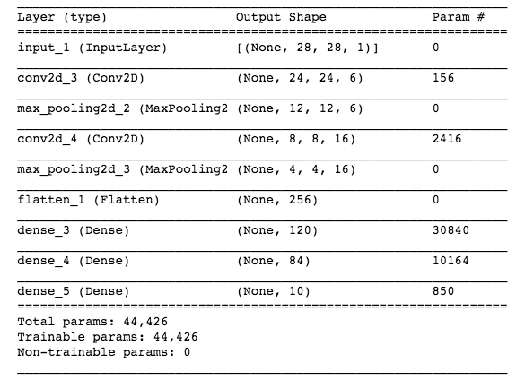
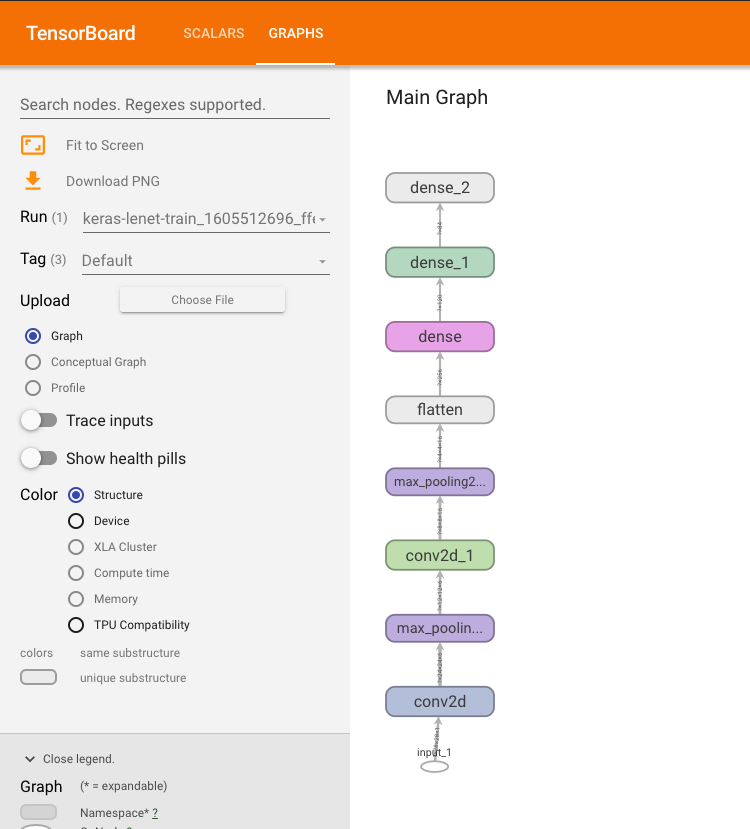

# Azure Machine Learning

---

## Azure 帳號申請

1. 進入https://login.microsoftonline.com/
2. 可以用 outlook 、 hotmail或其他email建立帳戶
3. 驗證email及真人身份
4. 進入https://azure.microsoft.com/
5. 按下*開始免費使用*
6. 填妥信用卡資訊
   - 免費使用階段不扣款，主動升級才會扣款
   - 一開始可免費使用30天，並有大約6100台幣的credit


----


## Azure CLI 安裝

- 官方文件：
  - https://docs.microsoft.com/zh-tw/cli/azure/install-azure-cli
- 在 Ubuntu 上安裝 Azure CLI

```bash
# 更新並安裝必要的套件
sudo apt-get update
sudo apt-get install ca-certificates \
curl apt-transport-https lsb-release gnupg

# 下載並安裝Microsoft signing key
curl -sL https://packages.microsoft.com/keys/microsoft.asc |
    gpg --dearmor |
    sudo tee /etc/apt/trusted.gpg.d/microsoft.gpg > /dev/null
```
---~

- 在 Ubuntu 上安裝 Azure CLI

```bash

# 新增Azure CLI software repository
AZ_REPO=$(lsb_release -cs)
echo "deb [arch=amd64] https://packages.microsoft.com/repos/azure-cli/ $AZ_REPO main" |
    sudo tee /etc/apt/sources.list.d/azure-cli.list

# 再次更新並安裝azure-cli
sudo apt-get update
sudo apt-get install azure-cli
```

----

## 登入Azure

```
az login
```

- 會出現一串代碼
- 進入https://aka.ms/devicelogin 
- 輸入上述代碼
- 選擇自己的帳戶登入

---

# Azure machine learning


              
---
                    

## Azure machine learning


- 建立工作區 
- 建立運算群組 
- 上傳檔案
- 執行實驗
  - 訓練模型
  - 註冊模型
- 部署服務
- 使用預測服務


              
----
                    

### 確認 Subscription ID 
#### (訂用帳戶 ID)

執行以下指令，取得 ID 和 Tenant ID
```
az account list
```


              
----
                    

### 建立工作區 

`create_workspace.py`
```python
from azureml.core import Workspace

work_space = Workspace.create(
    name="mltibame",  # 工作區名稱
    subscription_id="Your subscription ID",  
    resource_group="Tibame",  # 資源群組名稱
    create_resource_group=True,
    location="eastus2",  
    # example: 'eastus2', or 'southeastasia'.
)

# write out the workspace details to the file: 
# .azureml/config.json
work_space.write_config(path=".azureml")

```


              
----
                    
### 建立工作區 


</img>

              
----
                    

### 建立運算群組


`create_compute.py`
```python
from azureml.core import Workspace
from azureml.core.compute import ComputeTarget, AmlCompute
from azureml.core.compute_target import ComputeTargetException

# 建立工作區後，可以從 .azureml/config.json 讀取工作區資訊
work_space = Workspace.from_config()
```


              
----
                    

### 建立運算群組

`create_compute.py`
```python
# 確認運算群組是否存在，否則直接建立運算群組
cpu_cluster_name = "cpu-cluster"
try:
    cpu_cluster = ComputeTarget(
      workspace=work_space, name=cpu_cluster_name)
    print("Found existing cluster, use it.")
except ComputeTargetException:
    compute_config = AmlCompute.provisioning_configuration(
        vm_size="STANDARD_D2_V2", max_nodes=4, 
        idle_seconds_before_scaledown=2400
    )
    cpu_cluster = ComputeTarget.create(
      work_space, cpu_cluster_name, compute_config)
cpu_cluster.wait_for_completion(show_output=True)
```

----

在`workspace`的頁面左側，可以找到`計算`，點進去之後可以看到剛剛建立的計算叢集。


---
                    

### 簡易測試
`hello.py`
```python
print("Hello, Azure!")
```
- 執行實驗時，需要兩個script
  1. 一個在 Workspace 利用運算群組執行 `hello.py`
  2. 另一個 script `run_experiment.py` 在本機執行，使 Workspace 開始執行上述的 script


----
                    

### 簡易測試

`run_experiment.py`
```python
from azureml.core import (
  Workspace, Experiment, ScriptRunConfig)
work_space = Workspace.from_config()
# 建立實驗
experiment = Experiment(
  workspace=work_space, name="hello-experiment")
config = ScriptRunConfig(
    source_directory=".",  # code放在哪個資料夾
    script="hello.py",  # 要上傳的code
    compute_target="cpu-cluster"
)
run = experiment.submit(config)
aml_url = run.get_portal_url()
print(aml_url) # 此連結可以看到 log
run.wait_for_completion(show_output=True) # 過程中的紀錄都會列出
```


----


準備好上述程式碼後，我們就能執行：

```bash
python3.7 run_experiment.py
```

----

執行之後，程式碼會把程式碼上傳執行。執行的時間大概要十幾分鐘左右，這時候你會想，為什麼要這麼久？因為......
- Azure 會從 build docker image 開始，build 完，然後再推到 Azure Container Registry- ACR 存放，這一步應該就是最花時間的步驟了。到`workspace`，進入`實驗`（下圖中，左側 ***燒杯*** 圖示）中查看`輸出 + 紀錄檔`，可以看到`20_image_build_log.txt`，這檔案紀錄上述過程。

----

- 接著，會把 dcoker image 拉到虛擬機器中展開成 container（記錄在`55_azureml-excution-tvmp_xxxxx.txt`）。

----

- 然後，把需要執行的程式碼放入 container 之中（記錄在`65_jobp_prep-tvmp_xxxxx.txt`）。

----

- 終於可以執行`print("Hello Azure!")`了。如果上傳的程式碼出錯，也可以從這裡的紀錄發現錯誤訊息。通常會出問題的地方，多半是在使用者想要執行的程式碼上，所以可以透過觀察 `70_driver_log.txt` 發現問題所在。

----

- 最後結束實驗，把運算資源釋放出來。

              
---

## Upload data

要做匯率的預測模型，就必須準備匯率的歷史資料，我想[investing.com](https://investing.com)是不錯的資料來源，資料的歷史夠久，涵蓋各個國家的各項金融商品：債券、憑證、期貨、指數和股票，應有盡有（但沒有臺灣指數期貨QQ）。也有`Python`套件可以使用，套件也會隨著 investing.com 更新。取得歷史資料後，經過 normalization 後，就可以將資料上傳到`datastore` ，以便後續在`workspace`訓練模型時使用。

----

### 安裝`Python`套件

```bash
pip3.7 install investpy
pip3.7 install scikit-learn
```

----

### 示範程式

```python
from datetime import datetime
import os
import pickle
import investpy
from sklearn.preprocessing import MinMaxScaler


# 準備一個名叫 currency 的資料夾
if not os.path.isdir("currency"):
    os.system("mkdir currency")

# 從 investing.com 取得臺幣與美金的歷史匯率，取得每天的開盤價、最高價、最低價和收盤價
# 由於不知道資料從何時開始，我們先設定一個夠古老的日期，西元1900年01月01日開始
usd_twd = investpy.get_currency_cross_historical_data(
    "USD/TWD",
    from_date="01/01/1900", 
    to_date=datetime.now().strftime("%d/%m/%Y"),
)
# 拿到的資料是 pandas DataFrame，所以可以使用 pandas 的功能
usd_twd.reset_index(inplace=True)
usd_twd.to_csv("currency/usd_twd.csv", index=False)
# 將每天的收盤價作 normalization 調整成 0 ~ 1 之間，即 (x - min(x)) / (max(x) - min(x))
currency_data = usd_twd.Close.values.reshape(-1, 1)
scaler = MinMaxScaler(feature_range=(0, 1))
scaler.transform(currency_data)
# 將 scaler 存成 pickle 檔，方便之後使用
with open("currency/scaler.pickle", "wb") as f_h:
    pickle.dump(scaler, f_h)
f_h.close()

# 先取 2010/01/01 至 2020/12/31 的資料作為訓練資料
currency_data = usd_twd[
    (usd_twd.Date >= "2010-01-01") & (usd_twd.Date < "2021-01-01")
]
# 把資料存成 csv 檔，放到 currency 資料夾
currency_data.to_csv("currency/training_data.csv")
```

----

`upload_file.py`

```python
"""
Upload data to Azure machine learning
"""
import os
import argparse
from azureml.core import Workspace, Dataset
from azureml.core.authentication import InteractiveLoginAuthentication


# 為了方便可以重複使用，上傳不同的資料，所以用 command-line 帶入參數執行
# folder：本地端的資料夾，內含欲上傳資料
# target_folder：替上傳到 datastore 後的資料夾命名
# dataname：為上傳的資料集命名，會顯示在 workspace 的資料頁面中
def parse_args():
    """
    Parse arguments
    """
    parser = argparse.ArgumentParser()
    parser.add_argument("-f", "--folder", help="file folder", type=str)
    parser.add_argument(
        "-t", "--target_folder", help="file folder in datastore", type=str
    )
    parser.add_argument("-n", "--dataname", help="name of dataset", type=str)
    args = parser.parse_args()
    return args


def main():
    """
    Upload data to Azure machine learning
    """
    args = parse_args()
    interactive_auth = InteractiveLoginAuthentication(tenant_id=os.getenv("TENANT_ID"))
    work_space = Workspace.from_config(auth=interactive_auth)
    # workspace 有預設的 datastore，把資料存在預設的 datastore
    datastore = work_space.get_default_datastore()
    # 上傳資料
    datastore.upload(
        src_dir=args.folder, target_path=args.target_folder, overwrite=True
    )
    # 上傳資料之後，從 datastore 取得資料所在的資料夾，並將資料集註冊
    dataset = Dataset.File.from_files(path=(datastore, args.target_folder))
    dataset.register(work_space, name=args.dataname)


if __name__ == "__main__":
    main()
```

----

取得匯率資料，也準備好`upload_file.py`，就可以直接在 terminal 執行，上傳資料
```bash
python3.7 upload_file.py --folder currency --target_path currency --dataname currency
```

----
從相對路徑`currency`，上傳到 datastore 的`currency`資料夾，註冊資料集的名稱也為 currency。


----

點進瀏覽，也就能看到已經上傳的各個檔案了。


---
## Set Environment

之前，試著在`workspace`執行`print("Hello World")`時，會發現整體的執行時間非常長，主要是因為 Azure 需要準備 docker image 。但事實上，我們可以事先準備好環境，後續只會在第一次執行實驗時，需要建立 docker image ，之後每次執行實驗，只要選擇已經註冊好的環境，就可以省掉建立 docker image 的步驟了，大幅節省時間。

----

### 設定環境

`create_environment.py`
```python
"""
Create and register the environment
"""
import os
from azureml.core import Workspace, Environment
from azureml.core.authentication import InteractiveLoginAuthentication


def main():
    """
    Create and register the environment
    """
    interactive_auth = InteractiveLoginAuthentication(tenant_id=os.getenv("TENANT_ID"))
    work_space = Workspace.from_config(auth=interactive_auth)

    # 把需要的套件寫進 requirements.txt
    environment = Environment.from_pip_requirements(
        name="train_lstm", file_path="requirements.txt"
    )
    # 設定 python 版本
    environment.python.conda_dependencies.set_python_version("3.7.7")
    # 最後註冊環境，以便後續使用
    environment.register(work_space)


if __name__ == "__main__":
    main()

```

----

## 鎖定套件版本

為了讓訓練模型、收集數據和最後部署服務的環境都想同，列出所有需要用到的套件。另外，為了避免本地端使用的套件版本與`workspace`中有所差異，可以考慮直接鎖定版本。尤其是 keras 和 tensorflow ，版本有所差異，可能會讓部分語法有所不同，使得在執行實驗時發生各種錯誤。（謎之聲：懶得使用最新版的代價。）

----

`requirements.txt`
```
numpy
scikit-learn==0.23.2
pandas
tensorflow==1.13.1
Keras==2.2.4
azureml-defaults
investpy
h5py==2.10.0

```

----

- 註冊完之後，可以從環境的頁面看到自訂環境內，有剛剛註冊完的環境


----

- 環境被註冊之後，就可以透過以下作法取得

```python
environment = work_space.environments["train_lstm"]
```


----


- 另外，也可以看到 Azure 準備好的環境


----

- 針對 Azure 準備好的策劃環境（Curated Environment），可以根據環境的名稱取用，例如：

```python
from azureml.core import Workspace, Environment
from azureml.core.authentication import InteractiveLoginAuthentication

interactive_auth = InteractiveLoginAuthentication(tenant_id=os.getenv("TENANT_ID"))
work_space = Workspace.from_config(auth=interactive_auth)
env = Environment.get(workspace=work_space, name="AzureML-tensorflow-2.4-ubuntu18.04-py37-cpu-inference")

```

----

### 用 docker image 設定環境


- 也可以直接拿現成的 docker image 作為實驗的環境，這樣也可以事先在本地端測試，確保環境沒有問題。

```python

from azureml.core import Environment

environment = Environment("my_env")
environment.docker.enabled = True
environment.docker.base_image = "mcr.microsoft.com/azureml/intelmpi2018.3-ubuntu16.04:20210301.v1"

```

- Azure 也有提供一些已經事先準備好的 [docker image](https://docs.microsoft.com/en-us/azure/machine-learning/concept-prebuilt-docker-images-inference#list-of-prebuilt-docker-images-for-inference)，可以直接拿來設定環境。


---


## 執行實驗

- 在 Workspace 上執行 `train_keras.py`
- 在本機執行 `run_experiment_training.py`


              
---
                    

### 執行實驗

`train_keras.py`
```python
# 讀 MNIST 圖檔
def load_image(path):
    f = gzip.open(path, "r")
    image_size = 28
# 前面的16位元是檔案的描述，第17位元開始才是圖檔
    f.read(16)
    buf = f.read()
    data = np.frombuffer(
      buf, dtype=np.uint8).astype(np.float32)
    data = data.reshape(
      int(data.shape[0] / 28 / 28), image_size, image_size, 1)
    f.close()
    return data
```

              
---
                    

### 執行實驗

`train_keras.py`
```python
# 讀 MNIST label
def load_label(path):
    """
    Load label
    """
    f_p = gzip.open(path, "r")
# 前面的8位元是檔案的描述，第9位元開始才是label
    f_p.read(8)
    buf = f_p.read()
    data = np.frombuffer(
      buf, dtype=np.uint8).astype(np.int8)
    f_p.close()
    return data
```

              
---
                    

### 執行實驗
`train_keras.py`
```python
def parse_args():
    """
    Parse Arguments
    """
    parser = argparse.ArgumentParser()
# 在 Azure ML 放data的資料夾
    parser.add_argument(
      "--data_folder", type=str, 
      help="Path to the training data")
# 為了 Tensorboard，在 Azure ML 放log的資料夾
    parser.add_argument(
        "--log_folder", type=str, 
        help="Path to the log", default="./logs")
    args = parser.parse_args()
    return args
```


              
---
                    

### 執行實驗

`train_keras.py`
```python
args = parse_args()
# 取得執行實驗時的當下狀態
run = Run.get_context()
# Load mnist data
train_image = load_image(
    os.path.join(args.data_folder, 
    "train-images-idx3-ubyte.gz")
)
train_label = load_label(
    os.path.join(args.data_folder, 
    "train-labels-idx1-ubyte.gz")
)
# Normalize 到 0 ~ 1
train_image /= 255
train_label = to_categorical(train_label)
```

              
---
                    
### 執行實驗

`train_keras.py`
```python
# LeNet

input_layer = Input(shape=(28, 28, 1))
layers = Conv2D(
  filters=6, kernel_size=(5, 5), 
  activation="tanh")(input_layer)
layers = MaxPooling2D(pool_size=(2, 2))(layers)
layers = Conv2D(
  filters=16, kernel_size=(5, 5),
  activation="tanh")(layers)
layers = MaxPooling2D(pool_size=(2, 2))(layers)
layers = Flatten()(layers)
layers = Dense(120, activation="tanh")(layers)
layers = Dense(84, activation="tanh")(layers)
output = Dense(10, activation="softmax")(layers)
```

              
---
                    
### 執行實驗

`train_keras.py`
```
# LeNet

model = Model(inputs=input_layer, outputs=output)
model.compile(
    optimizer="adam", loss="categorical_crossentropy", 
    metrics=["accuracy"]
)
```

              
---
                    

### 執行實驗


</img> 


              
---
                    

### 執行實驗

`train_keras.py`
```
# Tensorboard- 觀察訓練過程，把觀察值記錄在 Log Folder
tb_callback = TensorBoard(
    log_dir=args.log_folder,
    histogram_freq=0,
    write_graph=True,
    write_images=True,
    embeddings_freq=0,
    embeddings_layer_names=None,
    embeddings_metadata=None,
)
```

              
---
                    
### 執行實驗

`train_keras.py`
```
# train the network- 把訓練過程中的觀察值記錄下來
history_callback = model.fit(
    train_image,
    train_label,
    epochs=10,
    validation_split=0.2,
    batch_size=10,
    callbacks=[tb_callback],
)
```

              
---
                    
### 執行實驗

`train_keras.py`

```
# ouput log- 把觀察值傳給 Workspace
run.log_list("train_loss", history_callback.history["loss"])
run.log_list("train_accuracy", history_callback.history["accuracy"])
run.log_list("val_loss", history_callback.history["val_loss"])
run.log_list("val_accuracy", history_callback.history["val_accuracy"])

print("Finished Training")
# 模型只能放在 outputs 資料夾
model.save("outputs/keras_lenet.h5")
print("Saved Model")
```


              
---
                    

### 執行實驗
`run_experiment_training.py`
```
import azureml
from azureml.core import (
  ScriptRunConfig, Dataset, 
  Workspace, Experiment, Environment)
from azureml.core.conda_dependencies import CondaDependencies
from azureml.core.model import Model
work_space = Workspace.from_config()

# 設定 dataset folder
datastore = work_space.get_default_datastore()
dataset = Dataset.File.from_files(
  path=(datastore, "datasets/mnist"))

```

              
---
                    
### 執行實驗
`run_experiment_training.py`
```
# 設定用來訓練模型的實驗
experiment = Experiment(
  workspace=work_space, name="keras-lenet-train")
# 每次上傳code時， Workspace 會跟本機的資料夾同步
# 若本機的資料夾檔案太大，可做以下設定，最多 2 Gb 
azureml._restclient.snapshots_client.SNAPSHOT_MAX_SIZE_BYTES=\
 2000000000
config = ScriptRunConfig(
    source_directory=".",
    script="train_keras.py",
    compute_target="cpu-cluster",
    arguments=[
        "--data_path",
        dataset.as_named_input("input").as_mount()])
```


              
---
                    
### 執行實驗
`run_experiment_training.py`
```

# 設定環境：安裝所需套件
environment = Environment("keras-environment")
environment.python.conda_dependencies = \
CondaDependencies.create(
    pip_packages=[
      "azureml-defaults", 
      "numpy", 
      "tensorflow==2.3.1"]
)
config.run_config.environment = environment

```


              
---
                    

### 執行實驗

`run_experiment_training.py`
```
# 執行實驗，開始訓練模型
run = experiment.submit(config)
aml_url = run.get_portal_url()
print(aml_url)

# tensorboard 呈現
tboard = Tensorboard([run])
tboard.start(start_browser=True)
run.wait_for_completion(show_output=True)
tboard.stop()
```


              
---
                    

### 執行實驗
`run_experiment_training.py`
```
# 註冊模型
metrics = run.get_metrics()
run.register_model(
    model_name="keras_mnist",
    tags={"data": "mnist", "model": "classification"},
    model_path="outputs/keras_lenet.h5",
    model_framework=Model.Framework.TENSORFLOW,
    model_framework_version="2.3.1",
# 紀錄最後一個epoch的觀察值
    properties={
        "train_loss": metrics["train_loss"][-1],
        "train_accuracy": metrics["train_accuracy"][-1],
        "val_loss": metrics["val_loss"][-1],
        "val_accuracy": metrics["val_accuracy"][-1]})
```

              
---
                    

### 執行實驗

#### Tensorboard

|  |  |
| ------------------- | ------------------- |

              
---
                    
### 部署服務

- 部署服務時，需要兩個script
  1. 一個在 Workspace 利用運算群組執行 `score_keras.py`
  2. 另一個 script `deploy_service.py` 在本機執行，將預測的服務在 Workspace 部署


              
---
                    


### 部署服務

`score_keras.py`
```
import os
import json
import numpy as np
from tensorflow.keras.models import load_model
def init(): 
    global model
# 從預設位置讀取模型
    model_path = os.path.join(
      os.getenv("AZUREML_MODEL_DIR"), "keras_lenet.h5")
    model = load_model(model_path)
def run(raw_data): 
    data = json.loads(raw_data)["data"]
    data = np.array(data).reshape((1, 28, 28, 1))
    y_hat = model.predict(data)
    return float(np.argmax(y_hat))
```


              
---
                    

### 部署服務

`deploy_service.py`

```
import numpy as np
from azureml.core import Environment, Model, Workspace
from azureml.core.conda_dependencies import CondaDependencies
from azureml.core.model import InferenceConfig
from azureml.core.webservice import AciWebservice

work_space = Workspace.from_config()
# 設定服務環境
environment = Environment("keras-service-environment")
environment.python.conda_dependencies = \
CondaDependencies.create(
   python_version="3.7.7",
   pip_packages=[
     "azureml-defaults", "numpy", "tensorflow==2.3.1"])

```


              
---
                    

### 部署服務

`deploy_service.py`

```
model = Model(work_space, "keras_mnist")
model_list = model.list(work_space)
# 找出 Validation Accuracy 最高的模型
validation_accuracy = []
version = []
for i in model_list:
   validation_accuracy.append(
     float(i.properties["val_accuracy"]))
   version.append(i.version)
model = Model(
   work_space, "keras_mnist", 
   version=version[np.argmax(validation_accuracy)]
)
```


              
---
                    

### 部署服務

`deploy_service.py`

```
service_name = "keras-mnist-service"
inference_config = InferenceConfig(
    entry_script="score_keras.py", environment=environment
)
# 設定運算時需要的 CPU 和 記憶體
aci_config = AciWebservice.deploy_configuration(
  cpu_cores=1, memory_gb=1)
```


              
---
                    
### 部署服務
`deploy_service.py`

```
# 部署服務
service = Model.deploy(
    workspace=work_space,
    name=service_name,
    models=[model],
    inference_config=inference_config,
    deployment_config=aci_config,
    overwrite=True,)
service.wait_for_deployment(show_output=True)
print(service.get_logs()) # 部署失敗的話，可以檢查 log
print(work_space.webservices) # 確認已部署服務
 ```

              
---
                    

### 使用預測服務


`predict_mnist_azml.py`
```
import argparse
import gzip
import json
import os
import requests
import numpy as np
from PIL import Image
args = parse_args()
# 讀取 MNIST test images
test_image = load_image(os.path.join(
  args.data_folder, "t10k-images-idx3-ubyte.gz"))
test_image /= 255
# 隨機挑選一張圖
testing_num = np.random.randint(
  low=0, high=len(test_image) - 1)
```


              
---
                    
### 使用預測服務

`predict_mnist_azml.py`
```
# 轉換浮點數成 JSON 字串
data = {"data": test_image[testing_num].tolist()}
input_data = json.dumps(data)
# Set the content type
headers = {"Content-Type": "application/json"}
# 透過 POST 訪問之前部署的服務
resp = requests.post(
  args.endpoint_url, input_data, headers=headers)
ans = resp.text.replace("[", "").replace("]", "").split(", ")
ans = int(float(ans[0]))
print("The answer is {}".format(ans))
array = np.reshape(test_image[testing_num] * 255, (28, 28))
img = Image.fromarray(array)
img.show()
```


              
---
                    

### 使用預測服務

`predict_mnist_azml.py`
```
# 如果要存成圖檔，必須先轉成 RGB 格式
img = img.convert("RGB")
img.save("output.png")

```


---

## 參考資料
- Azure Machine Learning documentation: https://tinyurl.com/yxzjslm5
  - Jupyter Notebook: https://tinyurl.com/r934vbp
  - Automated ML: https://tinyurl.com/y4koj4f2
  - Model Management: https://tinyurl.com/tf8w7cn

