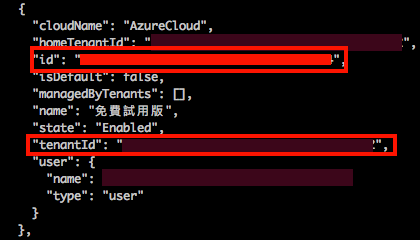
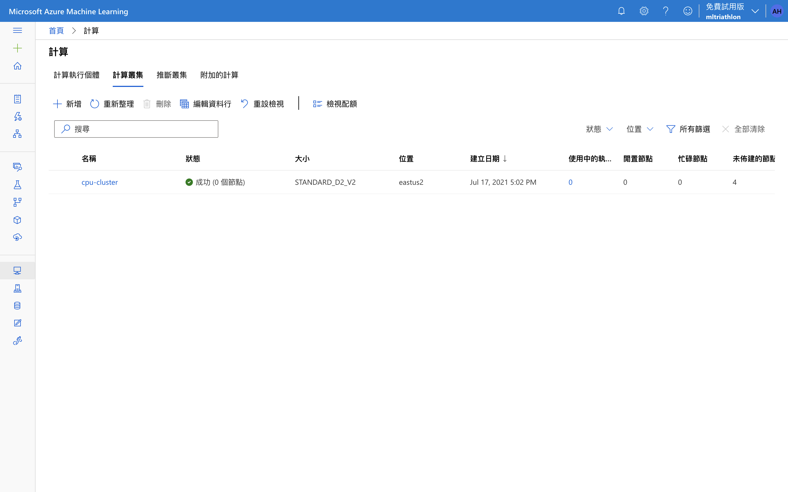
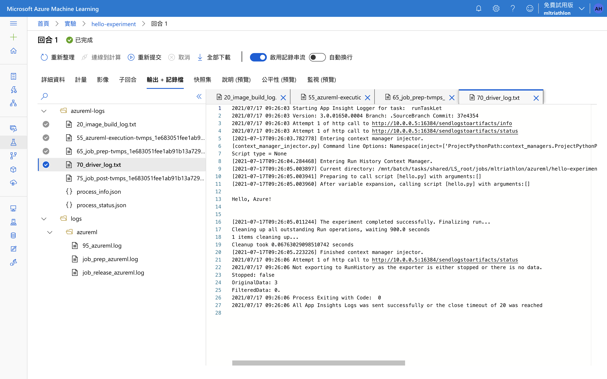
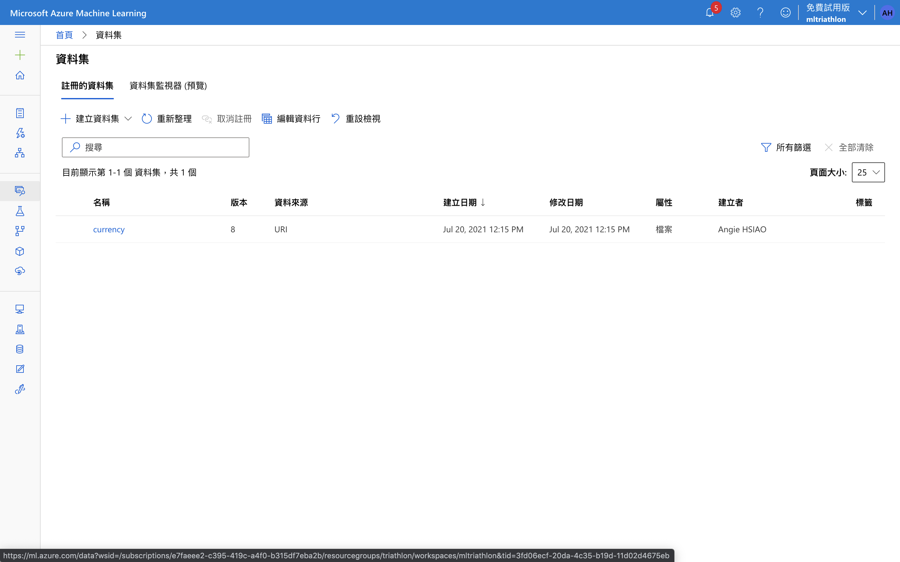
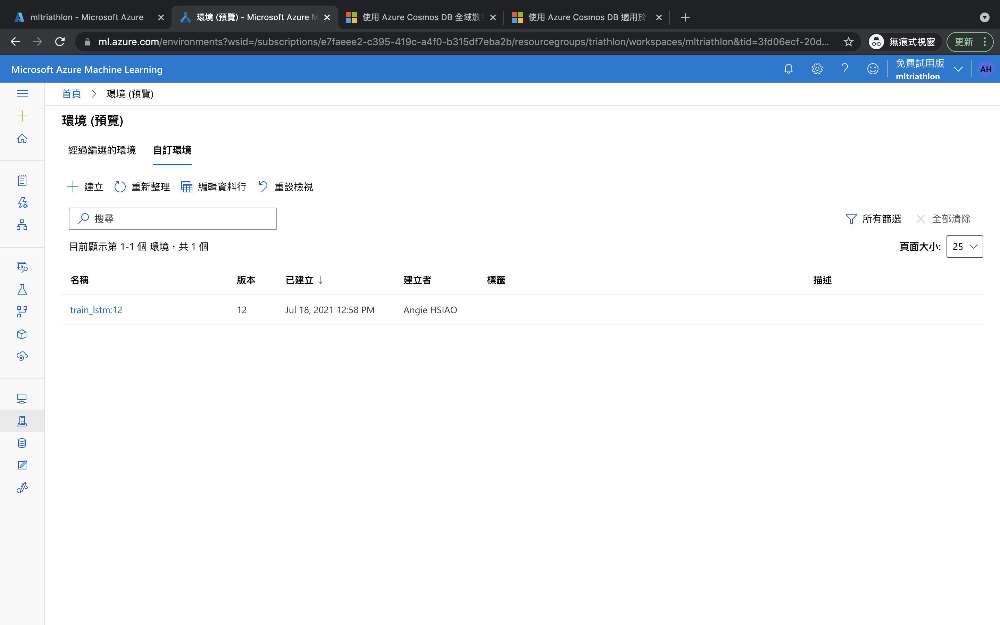
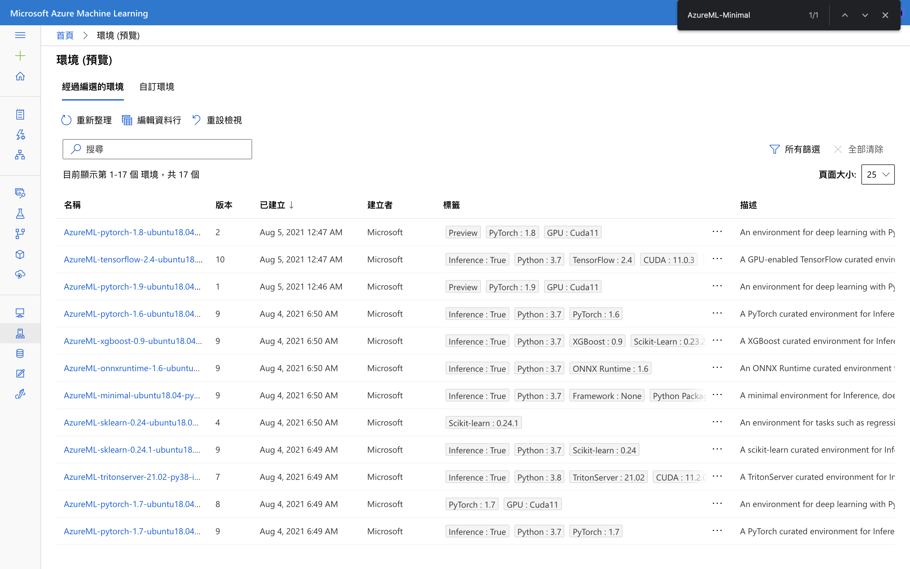
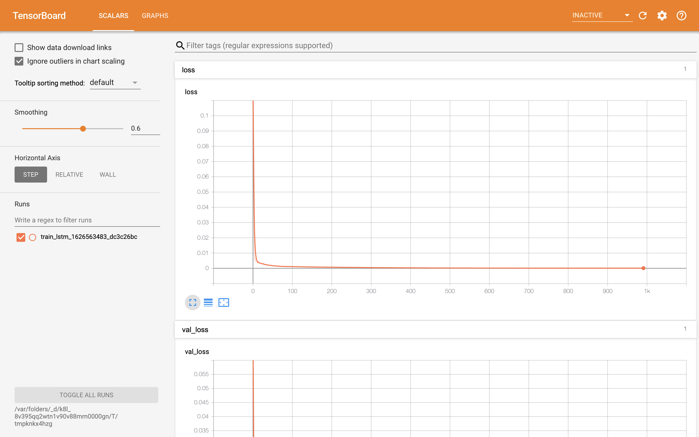
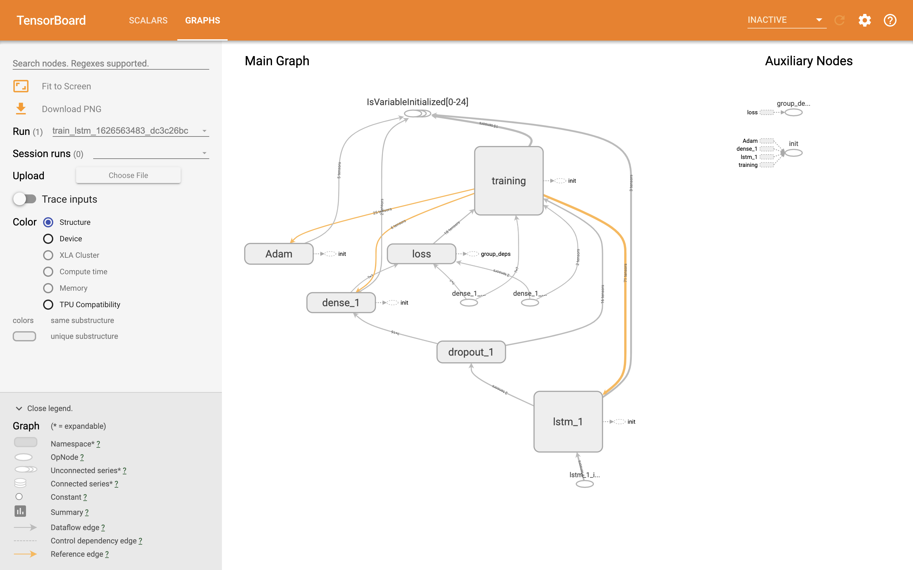
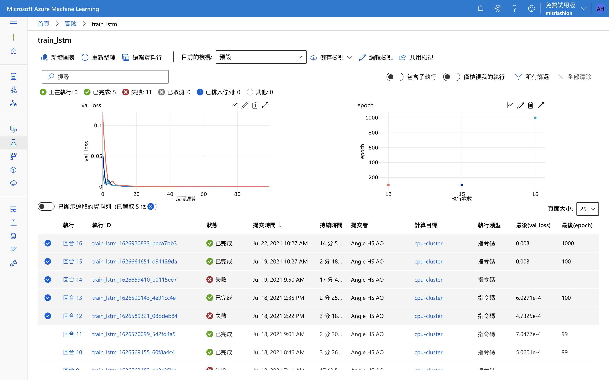
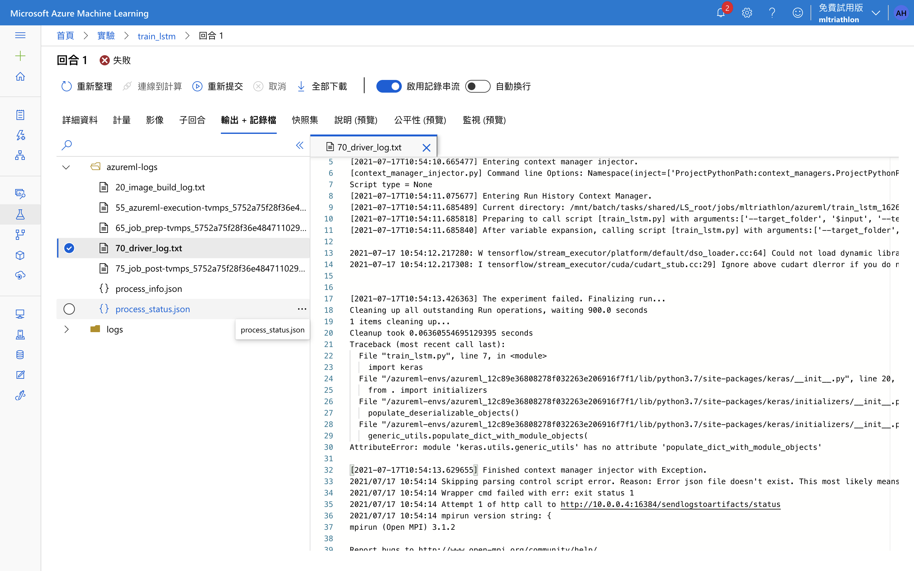

# Azure Machine Learning

---

## Azure 帳號申請

1. 進入https://login.microsoftonline.com/
2. 可以用 outlook 、 hotmail或其他email建立帳戶
3. 驗證email及真人身份
4. 進入https://azure.microsoft.com/
5. 按下*開始免費使用*
6. 填妥信用卡資訊
   - 免費使用階段不扣款，主動升級才會扣款
   - 一開始可免費使用30天，並有大約6100台幣的credit


----


## Azure CLI 安裝

- 官方文件：
  - https://docs.microsoft.com/zh-tw/cli/azure/install-azure-cli
- 在 Ubuntu 上安裝 Azure CLI

```bash
# 更新並安裝必要的套件
sudo apt-get update
sudo apt-get install ca-certificates \
curl apt-transport-https lsb-release gnupg

# 下載並安裝Microsoft signing key
curl -sL https://packages.microsoft.com/keys/microsoft.asc |
    gpg --dearmor |
    sudo tee /etc/apt/trusted.gpg.d/microsoft.gpg > /dev/null
```
---~

- 在 Ubuntu 上安裝 Azure CLI

```bash

# 新增Azure CLI software repository
AZ_REPO=$(lsb_release -cs)
echo "deb [arch=amd64] https://packages.microsoft.com/repos/azure-cli/ $AZ_REPO main" |
    sudo tee /etc/apt/sources.list.d/azure-cli.list

# 再次更新並安裝azure-cli
sudo apt-get update
sudo apt-get install azure-cli
```

----

## 登入Azure

```
az login
```

- 會出現一串代碼
- 進入https://aka.ms/devicelogin 
- 輸入上述代碼
- 選擇自己的帳戶登入

---

# Azure machine learning


              
---
                    

## Azure machine learning


- 建立工作區 
- 建立運算群組 
- 上傳檔案
- 執行實驗
  - 訓練模型
  - 註冊模型
- 部署服務
- 使用預測服務


              
----
                    

### 確認 Subscription ID 
#### (訂用帳戶 ID)

執行以下指令，取得 ID 和 Tenant ID
```
az account list
```




              
----
                    

### 建立工作區 

`create_workspace.py`
```python
from azureml.core import Workspace

work_space = Workspace.create(
    name="mltibame",  # 工作區名稱
    subscription_id="Your subscription ID",  
    resource_group="Tibame",  # 資源群組名稱
    create_resource_group=True,
    location="eastus2",  
    # example: 'eastus2', or 'southeastasia'.
)

# write out the workspace details to the file: 
# .azureml/config.json
work_space.write_config(path=".azureml")

```


              
----
                    
### 建立工作區 


</img>

              
----
                    

### 建立運算群組


`create_compute.py`
```python
from azureml.core import Workspace
from azureml.core.compute import ComputeTarget, AmlCompute
from azureml.core.compute_target import ComputeTargetException

# 建立工作區後，可以從 .azureml/config.json 讀取工作區資訊
work_space = Workspace.from_config()
```


              
----
                    

### 建立運算群組

`create_compute.py`
```python
# 確認運算群組是否存在，否則直接建立運算群組
cpu_cluster_name = "cpu-cluster"
try:
    cpu_cluster = ComputeTarget(
      workspace=work_space, name=cpu_cluster_name)
    print("Found existing cluster, use it.")
except ComputeTargetException:
    compute_config = AmlCompute.provisioning_configuration(
        vm_size="STANDARD_D2_V2", max_nodes=4, 
        idle_seconds_before_scaledown=2400
    )
    cpu_cluster = ComputeTarget.create(
      work_space, cpu_cluster_name, compute_config)
cpu_cluster.wait_for_completion(show_output=True)
```

----

在`workspace`的頁面左側，可以找到`計算`，點進去之後可以看到剛剛建立的計算叢集。





---
                    

### 簡易測試
`hello.py`
```python
print("Hello, Azure!")
```
- 執行實驗時，需要兩個script
  1. 一個在 Workspace 利用運算群組執行 `hello.py`
  2. 另一個 script `run_experiment.py` 在本機執行，使 Workspace 開始執行上述的 script


----
                    

### 簡易測試

`run_experiment.py`
```python
from azureml.core import (
  Workspace, Experiment, ScriptRunConfig)
work_space = Workspace.from_config()
# 建立實驗
experiment = Experiment(
  workspace=work_space, name="hello-experiment")
config = ScriptRunConfig(
    source_directory=".",  # code放在哪個資料夾
    script="hello.py",  # 要上傳的code
    compute_target="cpu-cluster"
)
run = experiment.submit(config)
aml_url = run.get_portal_url()
print(aml_url) # 此連結可以看到 log
run.wait_for_completion(show_output=True) # 過程中的紀錄都會列出
```


----


準備好上述程式碼後，我們就能執行：

```bash
python3.7 run_experiment.py
```

----

執行之後，程式碼會把程式碼上傳執行。執行的時間大概要十幾分鐘左右，這時候你會想，為什麼要這麼久？因為......
- Azure 會從 build docker image 開始，build 完，然後再推到 Azure Container Registry- ACR 存放，這一步應該就是最花時間的步驟了。到`workspace`，進入`實驗`（下圖中，左側 ***燒杯*** 圖示）中查看`輸出 + 紀錄檔`，可以看到`20_image_build_log.txt`，這檔案紀錄上述過程。

----

- 接著，會把 dcoker image 拉到虛擬機器中展開成 container（記錄在`55_azureml-excution-tvmp_xxxxx.txt`）。

----

- 然後，把需要執行的程式碼放入 container 之中（記錄在`65_jobp_prep-tvmp_xxxxx.txt`）。

----

- 終於可以執行`print("Hello Azure!")`了。如果上傳的程式碼出錯，也可以從這裡的紀錄發現錯誤訊息。通常會出問題的地方，多半是在使用者想要執行的程式碼上，所以可以透過觀察 `70_driver_log.txt` 發現問題所在。

----

- 最後結束實驗，把運算資源釋放出來。

              
---

## Upload data

要做匯率的預測模型，就必須準備匯率的歷史資料，我想[investing.com](https://investing.com)是不錯的資料來源，資料的歷史夠久，涵蓋各個國家的各項金融商品：債券、憑證、期貨、指數和股票，應有盡有（但沒有臺灣指數期貨QQ）。也有`Python`套件可以使用，套件也會隨著 investing.com 更新。取得歷史資料後，經過 normalization 後，就可以將資料上傳到`datastore` ，以便後續在`workspace`訓練模型時使用。

----

### 安裝`Python`套件

```bash
pip3.7 install investpy
pip3.7 install scikit-learn
```

----

### 示範程式

```python
from datetime import datetime
import os
import pickle
import investpy
from sklearn.preprocessing import MinMaxScaler


# 準備一個名叫 currency 的資料夾
if not os.path.isdir("currency"):
    os.system("mkdir currency")

# 從 investing.com 取得臺幣與美金的歷史匯率，取得每天的開盤價、最高價、最低價和收盤價
# 由於不知道資料從何時開始，我們先設定一個夠古老的日期，西元1900年01月01日開始
usd_twd = investpy.get_currency_cross_historical_data(
    "USD/TWD",
    from_date="01/01/1900", 
    to_date=datetime.now().strftime("%d/%m/%Y"),
)
# 拿到的資料是 pandas DataFrame，所以可以使用 pandas 的功能
usd_twd.reset_index(inplace=True)
usd_twd.to_csv("currency/usd_twd.csv", index=False)
# 將每天的收盤價作 normalization 調整成 0 ~ 1 之間，即 (x - min(x)) / (max(x) - min(x))
currency_data = usd_twd.Close.values.reshape(-1, 1)
scaler = MinMaxScaler(feature_range=(0, 1))
scaler.transform(currency_data)
# 將 scaler 存成 pickle 檔，方便之後使用
with open("currency/scaler.pickle", "wb") as f_h:
    pickle.dump(scaler, f_h)
f_h.close()

# 先取 2010/01/01 至 2020/12/31 的資料作為訓練資料
currency_data = usd_twd[
    (usd_twd.Date >= "2010-01-01") & (usd_twd.Date < "2021-01-01")
]
# 把資料存成 csv 檔，放到 currency 資料夾
currency_data.to_csv("currency/training_data.csv")
```

----

`upload_file.py`

```python
"""
Upload data to Azure machine learning
"""
import os
import argparse
from azureml.core import Workspace, Dataset
from azureml.core.authentication import InteractiveLoginAuthentication


# 為了方便可以重複使用，上傳不同的資料，所以用 command-line 帶入參數執行
# folder：本地端的資料夾，內含欲上傳資料
# target_folder：替上傳到 datastore 後的資料夾命名
# dataname：為上傳的資料集命名，會顯示在 workspace 的資料頁面中
def parse_args():
    """
    Parse arguments
    """
    parser = argparse.ArgumentParser()
    parser.add_argument("-f", "--folder", help="file folder", type=str)
    parser.add_argument(
        "-t", "--target_folder", help="file folder in datastore", type=str
    )
    parser.add_argument("-n", "--dataname", help="name of dataset", type=str)
    args = parser.parse_args()
    return args


def main():
    """
    Upload data to Azure machine learning
    """
    args = parse_args()
    interactive_auth = InteractiveLoginAuthentication(tenant_id=os.getenv("TENANT_ID"))
    work_space = Workspace.from_config(auth=interactive_auth)
    # workspace 有預設的 datastore，把資料存在預設的 datastore
    datastore = work_space.get_default_datastore()
    # 上傳資料
    datastore.upload(
        src_dir=args.folder, target_path=args.target_folder, overwrite=True
    )
    # 上傳資料之後，從 datastore 取得資料所在的資料夾，並將資料集註冊
    dataset = Dataset.File.from_files(path=(datastore, args.target_folder))
    dataset.register(work_space, name=args.dataname)


if __name__ == "__main__":
    main()
```

----

取得匯率資料，也準備好`upload_file.py`，就可以直接在 terminal 執行，上傳資料
```bash
python3.7 upload_file.py --folder currency --target_path currency --dataname currency
```

----
從相對路徑`currency`，上傳到 datastore 的`currency`資料夾，註冊資料集的名稱也為 currency。



----

點進瀏覽，也就能看到已經上傳的各個檔案了。


---
## Set Environment

之前，試著在`workspace`執行`print("Hello World")`時，會發現整體的執行時間非常長，主要是因為 Azure 需要準備 docker image 。但事實上，我們可以事先準備好環境，後續只會在第一次執行實驗時，需要建立 docker image ，之後每次執行實驗，只要選擇已經註冊好的環境，就可以省掉建立 docker image 的步驟了，大幅節省時間。

----

### 設定環境

`create_environment.py`
```python
"""
Create and register the environment
"""
import os
from azureml.core import Workspace, Environment
from azureml.core.authentication import InteractiveLoginAuthentication


def main():
    """
    Create and register the environment
    """
    interactive_auth = InteractiveLoginAuthentication(tenant_id=os.getenv("TENANT_ID"))
    work_space = Workspace.from_config(auth=interactive_auth)

    # 把需要的套件寫進 requirements.txt
    environment = Environment.from_pip_requirements(
        name="train_lstm", file_path="requirements.txt"
    )
    # 設定 python 版本
    environment.python.conda_dependencies.set_python_version("3.7.7")
    # 最後註冊環境，以便後續使用
    environment.register(work_space)


if __name__ == "__main__":
    main()

```

----

## 鎖定套件版本

為了讓訓練模型、收集數據和最後部署服務的環境都想同，列出所有需要用到的套件。另外，為了避免本地端使用的套件版本與`workspace`中有所差異，可以考慮直接鎖定版本。尤其是 keras 和 tensorflow ，版本有所差異，可能會讓部分語法有所不同，使得在執行實驗時發生各種錯誤。（謎之聲：懶得使用最新版的代價。）

----

`requirements.txt`
```
numpy
scikit-learn==0.23.2
pandas
tensorflow==1.13.1
Keras==2.2.4
azureml-defaults
investpy
h5py==2.10.0

```

----

- 註冊完之後，可以從環境的頁面看到自訂環境內，有剛剛註冊完的環境



----

- 環境被註冊之後，就可以透過以下作法取得

```python
environment = work_space.environments["train_lstm"]
```


----


- 另外，也可以看到 Azure 準備好的環境




----

- 針對 Azure 準備好的策劃環境（Curated Environment），可以根據環境的名稱取用，例如：

```python
from azureml.core import Workspace, Environment
from azureml.core.authentication import InteractiveLoginAuthentication

interactive_auth = InteractiveLoginAuthentication(tenant_id=os.getenv("TENANT_ID"))
work_space = Workspace.from_config(auth=interactive_auth)
env = Environment.get(workspace=work_space, name="AzureML-tensorflow-2.4-ubuntu18.04-py37-cpu-inference")

```

----

### 用 docker image 設定環境


- 也可以直接拿現成的 docker image 作為實驗的環境，這樣也可以事先在本地端測試，確保環境沒有問題。

```python

from azureml.core import Environment

environment = Environment("my_env")
environment.docker.enabled = True
environment.docker.base_image = "mcr.microsoft.com/azureml/intelmpi2018.3-ubuntu16.04:20210301.v1"

```

- Azure 也有提供一些已經事先準備好的 [docker image](https://docs.microsoft.com/en-us/azure/machine-learning/concept-prebuilt-docker-images-inference#list-of-prebuilt-docker-images-for-inference)，可以直接拿來設定環境。


---

## training experiment and register model

### 以 LSTM 模型為例

----

依照之前的介紹，在`workspace`執行實驗訓練模型時，也需要兩個`Python` script：
  1. 一個要在`workspace`利用計算叢集執行的程式碼：`train_lstm.py`，其主要任務為訓練模型，應該考慮的步驟如下：
      - 取得資料
      - 整理資料
      - 建構模型
      - 訓練模型
      - 輸出模型與訓練結果

----

  2. 另一個 script `run_experiment_training.py` 在本機執行，把`train_lstm.py`上傳，並且通知`workspace`開始執行`train_lstm.py`。除了呼叫`train_lstm.py`來訓練模型之外，最後也會註冊訓練完的模型。

另外，這邊額外介紹一個功能，Azure machine learning 也可以將訓練過程中的各項觀察數值（例如：`loss`），利用`tensorboard`觀察。

----

### 安裝`Python`套件

請在本地端安裝
```bash
pip3.7 install azureml-tensorboard
```

----

### `workspace`的環境設定

請參考[Azure machine learning: set environment- 準備一個大家都能用的環境](https://ithelp.ithome.com.tw/articles/10269544)，如果環境沒有設定好，一定會遇到一連串的錯誤訊息，在此提醒各位。

----

### 示範程式


`train_lstm.py`
```python
import argparse
import os
import pickle
import numpy as np
from azureml.core.run import Run
from azureml.core.model import Model
import pandas as pd
from keras.models import Sequential, load_model
from keras.layers import Dense, LSTM, Dropout
from keras.preprocessing.sequence import TimeseriesGenerator
from keras.callbacks import TensorBoard


# 產生 training data 和 validation data
def data_generator(data, data_len=240):
    """
    generate data for training and validation
    """
    generator = TimeseriesGenerator(
        data=data, targets=range(data.shape[0]), length=data_len, batch_size=1, stride=1
    )
    x_all = []
    for i in generator:
        x_all.append(i[0][0])
    x_all = np.array(x_all)
    y_all = data[range(data_len, len(x_all) + data_len)]
    # 資料的前面六成作為訓練之用，後面時間較新的四成資料作為驗證之用
    rate = 0.4
    x_train = x_all[: int(len(x_all) * (1 - rate))]
    y_train = y_all[: int(y_all.shape[0] * (1 - rate))]
    x_val = x_all[int(len(x_all) * (1 - rate)) :]
    y_val = y_all[int(y_all.shape[0] * (1 - rate)) :]
    return x_train, y_train, x_val, y_val


def parse_args():
    """
    Parse arguments
    """
    parser = argparse.ArgumentParser()
    parser.add_argument("--target_folder", type=str, help="Path to the training data")
    parser.add_argument(
        "--experiment",
        type=bool,
        default=False,
        help="Just run an experiment, there is no pipeline",
    )
    # 此處的 log folder 是為了使用 tensorboard ，在 workspace 之中訓練時的相對路徑，儲存訓練過程中的觀察數值
    parser.add_argument(
        "--log_folder", type=str, help="Path to the log", default="./logs"
    )
    args = parser.parse_args()
    return args


def main():
    """
    Training of LeNet with keras
    """
    args = parse_args()
    run = Run.get_context()
    # 從 datastore 讀取資料，並且加以整理
    usd_twd = pd.read_csv(os.path.join(args.target_folder, "training_data.csv"))
    data = usd_twd.Close.values.reshape(-1, 1)
    with open(os.path.join(args.target_folder, "scaler.pickle"), "rb") as f_h:
        scaler = pickle.load(f_h)
    f_h.close()
    data = scaler.transform(data)
    data_len = 240
    x_train, y_train, x_val, y_val = data_generator(data, data_len)
    # 這裡留一個伏筆，之後還需要考慮到 pipeline 的情況，在使用 pipeline 的時候部分步驟會省略
    if args.experiment:
    # 模型很簡單，LSTM 後，就接 dropout，最後再加一層 full connected network 就直接輸出了
        model = Sequential()
        model.add(LSTM(16, input_shape=(data_len, 1)))
        model.add(Dropout(0.1))
        model.add(Dense(1))
        model.compile(loss="mse", optimizer="adam")
        # Tensorboard
        callback = TensorBoard(
            log_dir=args.log_folder,
            histogram_freq=0,
            write_graph=True,
            write_images=True,
            embeddings_freq=0,
            embeddings_layer_names=None,
            embeddings_metadata=None,
        )
    # 訓練模型
    history_callback = model.fit(
        x_train,
        y_train,
        epochs=1000,
        batch_size=240,
        verbose=1,
        validation_data=[x_val, y_val],
        callbacks=[callback],
    )

    # 訓練過程中產生的數值，都可以輸出到 workspace ，可以在 workspace 的網頁上看到
    # 可以輸出的資料有上限，資料長度上限是 250，所以不要把所有 loss 都塞進去
    # 另外該注意的是，所有數值必須以 list 的格式輸出
    metrics = history_callback.history
    run.log_list("train_loss", metrics["loss"][:10])
    run.log_list("val_loss", metrics["val_loss"][:10])
    run.log_list("start", [usd_twd.Date.values[0]])
    run.log_list("end", [usd_twd.Date.values[-1]])
    run.log_list("epoch", [len(history_callback.epoch)])

    print("Finished Training")
    # 這邊要非常注意！！！！只能將模型存在 outputs 這個資料夾之下，後續才能註冊模型
    model.save("outputs/keras_lstm.h5")
    print("Saved Model")
    # 順便將 scaler 存檔，以便註冊
    if args.experiment:
        with open("outputs/scaler.pickle", "wb") as f_h:
            pickle.dump(scaler, f_h)
        f_h.close()
    


if __name__ == "__main__":
    main()

```

----


`run_experiment_training.py`
```python

import os
import argparse
from azureml.core import ScriptRunConfig, Dataset, Workspace, Experiment
from azureml.tensorboard import Tensorboard
from azureml.core.authentication import InteractiveLoginAuthentication


def parse_args():
    """
    Parse arguments
    """
    parser = argparse.ArgumentParser()
    # 提供 py 檔
    parser.add_argument("-f", "--file", help="python script", type=str)
    # target_folder 則是需要輸入當初上傳到 Azure 資料夾路徑
    parser.add_argument(
        "-t", "--target_folder", help="file folder in datastore", type=str
    )
    args = parser.parse_args()
    return args


def main():
    """
    Run the experiment for training
    """
    args = parse_args()
    interactive_auth = InteractiveLoginAuthentication(tenant_id=os.getenv("TENANT_ID"))
    work_space = Workspace.from_config(auth=interactive_auth)

    # 從 datastore 取得資料
    datastore = work_space.get_default_datastore()
    dataset = Dataset.File.from_files(path=(datastore, args.target_folder))

    # 設定實驗，名稱可以隨意，這邊是直接以輸入的 py 檔為名
    experiment = Experiment(workspace=work_space, name=args.file.replace(".py", ""))
    # 設定要在 workspace 執行的 py 檔的檔名與路徑，選定運算集群，並且將 py 檔會用到的參數放在 arguments
    config = ScriptRunConfig(
        source_directory=".",
        script=args.file,
        compute_target="cpu-cluster",
        arguments=[
            "--target_folder",
            dataset.as_named_input("input").as_mount(), # 輸入資料集在 datastore 的路徑
            "--experiment",
            True,
            "--log_folder",
            "./logs",
        ],
    )

    # 選擇已經註冊的環境，之前的環境也是以 py 檔的檔名命名
    environment = work_space.environments[args.file.replace(".py", "")]
    config.run_config.environment = environment

    # 開始進行實驗，訓練模型
    run = experiment.submit(config)
    # 取得 URL，透過瀏覽器觀察實驗過程
    aml_url = run.get_portal_url()
    print(
        "Submitted to an Azure Machine Learning compute cluster. Click on the link below"
    )
    print("")
    print(aml_url)


    # 開啟 tensorboard
    tboard = Tensorboard([run])
    # 自動開啟瀏覽器
    tboard.start(start_browser=True)
    run.wait_for_completion(show_output=True)
    # 這邊設定一個緩衝，實驗執行完後，在 terminal 按下 enter ，才會結束 tensorboard
    print("Press enter to stop")
    input()
    tboard.stop()

    # 最後註冊模型，所有模型都必須放到 outputs/ 的路徑之下
    # properties 可以用來記錄跟此模型有關的所有數值
    metrics = run.get_metrics()
    run.register_model(
        model_name=args.target_folder,
        tags={"model": "LSTM"},
        model_path="outputs/keras_lstm.h5",
        model_framework="keras",
        model_framework_version="2.2.4",
        properties={
            "train_loss": metrics["train_loss"][-1],
            "val_loss": metrics["val_loss"][-1],
            "data": "USD/TWD from {0} to {1}".format(metrics["start"], metrics["end"]),
            "epoch": metrics["epoch"],
        },
    )

    run.register_model(
        model_name="scaler",
        tags={"data": "USD/TWD from 1983-10-04", "model": "MinMaxScaler"},
        model_path="outputs/scaler.pickle",
        model_framework="sklearn",
    )


if __name__ == "__main__":
    main()

```

----

### 執行實驗

```bash
python3.7 run_experiment_training.py --file train_lstm.py --target_folder currency
```

執行上述指令後，整個流程大約需要 15 分鐘，一開始可以考慮把 epochs 設定成 100 或更少，確認整個流程沒有問題，再把 epochs 放大。實驗執行沒多久，就會從瀏覽器開啟 tensorboard ，但不會馬上就有圖表，因為還需要設定環境，需要等一下。Tensorboard 出現的圖表，即是訓練過程中的`loss`隨著訓練的變化。另外，也可以看到訓練模型的結構。

----

### Tensorboard

 

----


### Tensorboard

 |

----

從`workspace`的網頁也可以看到，實驗執行完之後的各種數據視覺化。



----

這邊有一些實驗的限制，[可供參考](https://docs.microsoft.com/en-us/azure/machine-learning/resource-limits-quotas-capacity)。

終於完成一次模型訓練了，這一步因為`keras`和`tensorflow`的版本相容性問題，讓我踩了幾次雷（謎之音：因為太久沒更新了，不知道外面的世界長怎樣......）。在實驗過程中，會出現的問題，多半都是跟上傳上去的程式碼有關，最常出現的錯誤，大概有三種：套件、路徑和寫錯字。出錯之後，到`workspace`上觀察一下紀錄（`70_drive_log.txt`），多半都能看出端倪。


----




----

從`workspace`上也可以看到註冊過的模型。點選進去每個模型，也能下載下來使用。


----

提供以下程式碼，視覺化預測結果。比較一下 2020 ～ 2021 年的真實匯率與預測結果。
```python
from plotly.offline import iplot, plot, init_notebook_mode
import plotly.graph_objects as go
init_notebook_mode(connected=True)

USD_TWD = investpy.get_currency_cross_historical_data('USD/TWD', from_date='01/01/1900', to_date='01/09/2021')
USD_TWD.reset_index(inplace=True)
data = USD_TWD.Close.values.reshape(-1, 1)
data = scaler.transform(data)
data_len = 240
generator = TimeseriesGenerator(data=data, targets=range(data.shape[0]), length=data_len, batch_size=1, stride=1)
X = []
for i in generator:
    X.append(i[0][0])
X = np.array(X)
Y = data[range(data_len, len(X) + data_len)]
prediction = model.predict(X)
prediction = scaler.inverse_transform(prediction)
Y = scaler.inverse_transform(Y)
date = USD_TWD.Date.values[range(data_len, len(X) + data_len)]
date = [str(i)[:10] for i in date]
result = pd.DataFrame(dict(date=date, real=Y.flatten(), prediction=prediction.flatten()))
result = result[result.date >= '2020']

fig = [
    go.Scatter(x=result.date, y=result.prediction, name='Real'),
    go.Scatter(x=result.date, y=result.real, name='Prediction'),]
iplot(fig, filename='test')
```
----

看起來大致上趨勢相同，整體上亦步亦趨。

              
---

# deploy service and inference

----


### 部署服務與使用服務

- 部署服務時，一樣需要兩份 py 檔
  1. 一個在`workspace`利用運算群組執行`predict_currency.py`
  2. 另一個是`deploy_currency_prediction.py`，在本機執行，將預測的服務部署在`workspace`

----

- 使用服務，也就是標題上所寫的 inference，這個詞直接查字典的話，意思是推論或推斷，可以想做，我們利用過去蒐集到的資料做成一個模型之後，利用此模型推論未來的情境。白話一點，其實就是把做好的模型拿來使用。服務部署完成後，會產生該服務的 API ，便可以透過 API 使用預測服務了。

----

### 示範程式

- 用來執行預測服務的程式碼結構基本上是固定的，必須定義兩個 function：
    - `init`：讀取模型。
    - `run`：當使用者呼叫 API 時，執行預測，並回傳結果。

----

`predict_currency.py`
```python
import os
from datetime import datetime, timedelta
import pickle
from keras.models import load_model
import investpy


def init():
    """
    Load the model
    """
    global model
    global scaler
    
    # 模型的預設路徑就是 /var/azureml-app/azureml-models/，從中找到相對應的模型
    for root, _, files in os.walk("/var/azureml-app/azureml-models/", topdown=False):
        for name in files:
            if name.split(".")[-1] == "h5":
                model_path = os.path.join(root, name)
            elif name.split(".")[-1] == "pickle":
                scaler_path = os.path.join(root, name)
    model = load_model(model_path)
    with open(scaler_path, "rb") as f_h:
        scaler = pickle.load(f_h)
    f_h.close()

# 這邊的 raw_data 並沒有被使用到，因為資料可以直接透過 investpy 取得。
# 但因為直接省略 raw_data ，是無法部署的，所以只好保留。
def run(raw_data):
    """
    Prediction
    """
    
    today = datetime.now()
    data = investpy.get_currency_cross_historical_data(
        "USD/TWD",
        from_date=(today - timedelta(weeks=105)).strftime("%d/%m/%Y"),
        to_date=today.strftime("%d/%m/%Y"),
    )
    data.reset_index(inplace=True)
    data = data.tail(240).Close.values.reshape(-1, 1)
    data = scaler.transform(data)
    data = data.reshape((1, 240, 1))
    ans = model.predict(data)
    ans = scaler.inverse_transform(ans)
    # 要注意回傳的數值必須要是 JSON 支援的資料格式
    return float(ans[0][0])
```
----

- 部署服務時，需要考慮執行環境，如果沒有事先準備好現成的環境，服務部屬的時間會非常久，因為會從環境準備開始。
- 需要指定模型，包含版本和名稱，這樣`predict_currency.py`才找得到相對應的模型。

----

`deploy_currency_prediction.py`
```python
import os
import numpy as np
from azureml.core import Model, Workspace
from azureml.core import Run
from azureml.core.model import InferenceConfig
from azureml.core.webservice import AciWebservice
from azureml.core.authentication import InteractiveLoginAuthentication


def main():
    """
    Deploy model to your service
    """
    # 為了之後 pipeline 的使用，所以使用兩種方式取得 workspace。
    run = Run.get_context()
    try:
        work_space = run.experiment.workspace
    except AttributeError:
        interactive_auth = InteractiveLoginAuthentication(
            tenant_id=os.getenv("TENANT_ID")
        )
        work_space = Workspace.from_config(auth=interactive_auth)
    # 選擇之前已經建立好的環境
    environment = work_space.environments["train_lstm"]
    
    # 選擇模型，如果不挑選版本，則會直接挑選最新模型
    model = Model(work_space, "currency")
    
    # scaler 也是會用到
    scaler = Model(work_space, name="scaler", version=1)
    # 設定部署服務的 config
    service_name = "currency-service"
    inference_config = InferenceConfig(
        entry_script="predict_currency.py", environment=environment
    )
    # 設定執行服務的資源
    aci_config = AciWebservice.deploy_configuration(cpu_cores=1, memory_gb=1)
    
    # 部署服務
    service = Model.deploy(
        workspace=work_space,
        name=service_name,
        models=[model, scaler],
        inference_config=inference_config,
        deployment_config=aci_config,
        overwrite=True,
    )
    service.wait_for_deployment(show_output=True)
    print(service.get_logs())
    # 印出服務連結，之後就是利用這個連結提供服務
    print(service.scoring_uri)


if __name__ == "__main__":
    main()
```

----

- 服務部署完成之後，可以到`workspace`的端點，檢視服務的相關資訊。


----

- 點進去剛剛產生的服務，可以看到 REST 端點，這其實就是服務連結，可以透過`POST`使用。 


----

- 接著，便可嘗試呼叫剛剛取得的服務連結來使用服務

`predict_currency_azml.py`
```python

import argparse
import json
import requests


def parse_args():
    """
    Parse arguments
    """
    parser = argparse.ArgumentParser()
    # endpoint url 就是 API 的連結
    parser.add_argument("-e", "--endpoint_url", type=str, help="Endpoint url")
    args = parser.parse_args()
    return args


def main():
    """
    Predict mnist data with Azure machine learning
    """
    args = parse_args()
    data = {"data": ""}
    # 將資料轉換成 JSON 
    input_data = json.dumps(data)
    # Set the content type
    headers = {"Content-Type": "application/json"}

    # 使用 POST 呼叫 API
    resp = requests.post(args.endpoint_url, input_data, headers=headers)

    print("The answer is {}".format(resp.text))


if __name__ == "__main__":
    main()
```
----

直接在 terminal 執行 

```bash
python3.7 predict_currency_azml.py -e 你的 API 連結
```
就會得到預測結果了。

---


## 參考資料
- Azure Machine Learning documentation: https://tinyurl.com/yxzjslm5
  - Jupyter Notebook: https://tinyurl.com/r934vbp
  - Automated ML: https://tinyurl.com/y4koj4f2
  - Model Management: https://tinyurl.com/tf8w7cn

